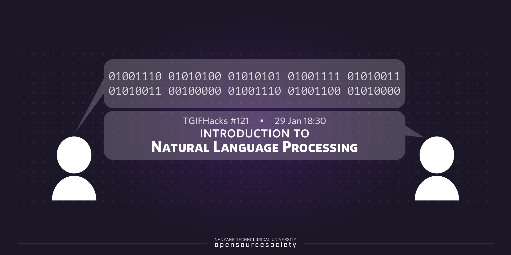

<h1 style="font-weight:bold" align="center">NTU OSS: Introduction to Natural Language Processing</h1>

    

<h2 style="font-weight:bold">About the workshop</h2>

Natural language processing is a rich domain in the field of deep learning concerning the interaction between computers and human language. It is one of the most broadly applied areas of deep learning with applications such as question-answering, sentiment analysis, machine translation, and chatbots.

In this workshop, we cover fundamentals of NLP such as word embeddings, probabilistic and neural language models. We'll cover all the theory behind these topics and finally build a simple language model to get some hands-on experience. Understanding these foundational concepts will help you to learn about more advanced topics such as sequence and attention models.

<h2 style="font-weight:bold">Table of Content</h2>
<ol style="font-size:15px">
<li>
    Introduction
</li>

<li>
    Word Embeddings
    <ul>
        <li>How are words represented?</li>
        <li>How are these representations created?</li>
    </ul>
</li>

<li>
    Language Modelling
    <ul>
        <li>what is language modelling?</li>
        <li>Importance of Language Modelling</li>
        <li>
        Different Types of language models
        <ul>
            <li>Probabilistic Models</li>
            <li>Neural Models</li>
        </ul>
        </li>
    </ul>
</li>

<li>
    Hands-On Exercise
    <ul>
        <li>How to use word embeddings?</li>
        <li>Creating a simple language model using Tensorflow</li>    
    </ul>
</li>

</ol>

<h2 style="font-weight:bold">Further Readings</h2>

1. http://jalammar.github.io/illustrated-word2vec/

2. https://www.coursera.org/specializations/natural-language-processing

3. https://www.youtube.com/watch?v=8rXD5-xhemo&list=PLoROMvodv4rOhcuXMZkNm7j3fVwBBY42z&index=1
